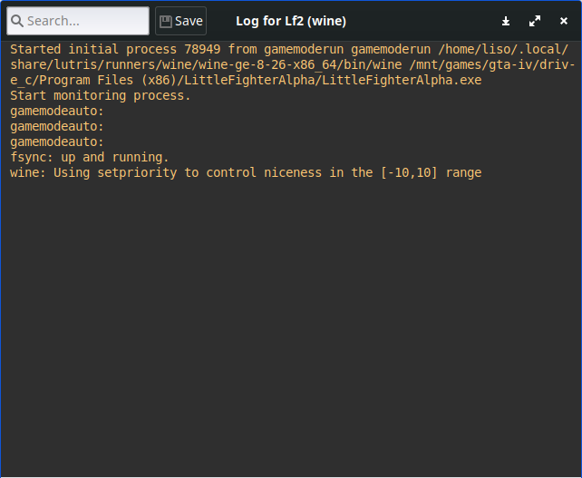

Just today when I was about to run a game in lutris, I saw this error message popping up. It came out on lutris log window, and it goes something like:
```
ERROR: ld.so: object 'libgamemodeauto.so.0' from LD_PRELOAD cannot be preloaded (cannot open shared object file): ignored.
ERROR: ld.so: object 'libgamemodeauto.so.0' from LD_PRELOAD cannot be preloaded (cannot open shared object file): ignored.
ERROR: ld.so: object 'libgamemodeauto.so.0' from LD_PRELOAD cannot be preloaded (cannot open shared object file): ignored.
```

So being the learner I am, I decided to google the error to seek for solution, luckily my google-fu doesn't disappoint me (hehe), I quickly found a solution here &rarr; https://github.com/FeralInteractive/gamemode/issues/254#issuecomment-890564758

Basically the error message tells me that I don't have 32 bit libraries available, whilst the game requesting it, this is because the  environment the game was put on is 32 bit wineprefix, the solution is to install 32 bit version of FeralInteractive gamemode libraries.

```
cd /tmp
mkdir gamemode
wget http://ftp.debian.org/debian/pool/main/g/gamemode/gamemode_1.7-2+b1_amd64.deb http://ftp.debian.org/debian/pool/main/g/gamemode/gamemode-daemon_1.7-2+b1_amd64.deb http://ftp.debian.org/debian/pool/main/g/gamemode/libgamemode0_1.7-2+b1_amd64.deb http://ftp.debian.org/debian/pool/main/g/gamemode/libgamemodeauto0_1.7-2+b1_amd64.deb http://ftp.debian.org/debian/pool/main/g/gamemode/libgamemode0_1.7-2+b1_i386.deb http://ftp.debian.org/debian/pool/main/g/gamemode/libgamemodeauto0_1.7-2+b1_i386.deb
sudo apt install ./gamemode_1.7-2+b1_amd64.deb ./gamemode-daemon_1.7-2+b1_amd64.deb ./libgamemode0_1.7-2+b1_amd64.deb ./libgamemode0_1.7-2+b1_i386.deb ./libgamemodeauto0_1.7-2+b1_amd64.deb ./libgamemodeauto0_1.7-2+b1_i386.deb
```

And quickly you can see the error is gone.



Very nice !